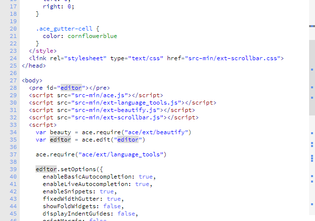

# Ace Editor Scrollbars
CSS Scrollbars for [Ace Editor](https://github.com/ajaxorg/ace)

Simple to use CSS styled scrollbars:

Just link to two files then initialise the scrollbars after initialising Ace.

    <link rel="stylesheet" type="text/css" href="ext-scrollbar.min.css">
    

    
### Added search/occurance map

